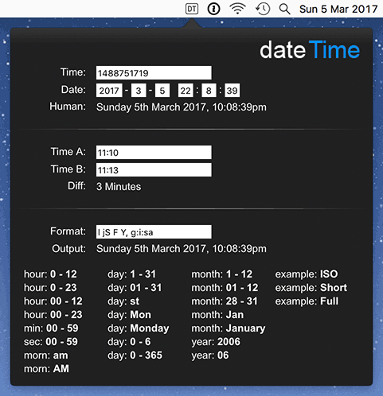

A simple widget to help with:

1. Converting to and from the UNIX timestamp.
2. Comparing two dates or times.
3. Date formatting in PHP.

---

The XCode version of this widget, using Swift 3, uses a WebView.

It does this by adding an icon to NSStatusBar (the system menu bar), where a left click will open an NSPopover (which contains the WebView).

The widget intentionally remains open until a second left click (so multiple values can be copy/pasted).

A right hand click will open an NSMenu, allowing the user to quit.

The majority of the code is in HTML/CSS/JavaScript (found in the [View](./xcode/DateTime/View) folder).

But PHP is used for date formatting and the timestamp diff.

This is is done by JavaScript calling `DateTimeApp.message()`, which is received by the swift function `DateTimeMessage`, and passed on to PHP. The response is returned to JavaScript.

Each time the popover is opened, is calls the `dateTime.onShow()` function, which allows the JavaScript to reset the fields.

For styling purposes, the popover uses NSAppearanceNameVibrantDark, while the WebView has `drawsBackground = false`.

To make it load faster, the popover has `animates = false`, and the JavaScript uses `setTimeout` so it does not need to wait for the PHP to respond.

To help debug the HTML/CSS/JavaScript, you can use:

	defaults write uk.co.craigfrancis.DateTime WebKitDeveloperExtras -bool true
